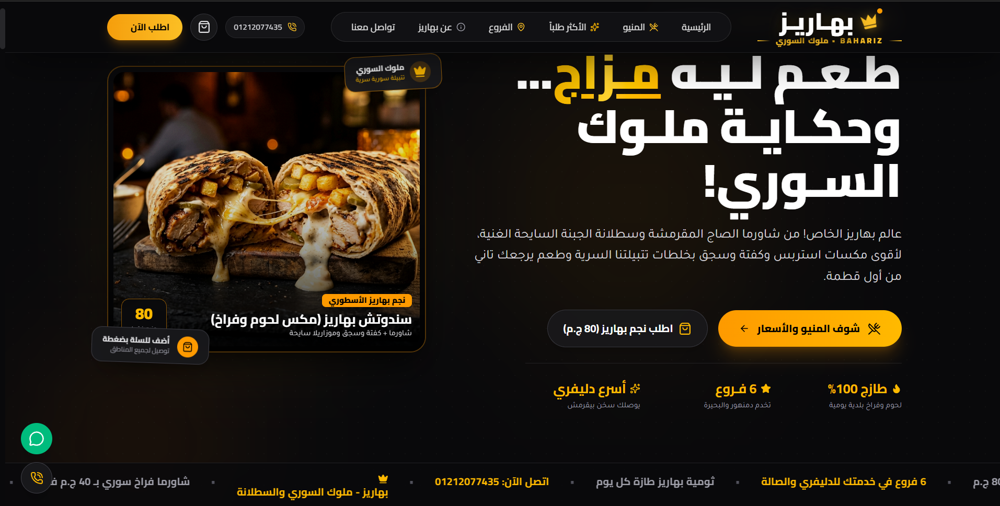

# BAHARIZ — ملوك السوري

A complete Arabic restaurant website for Bahariz, presenting the Syrian food menu, branches, offers, delivery experience, and direct ordering in a bold responsive interface.



## Features

- Arabic RTL restaurant experience
- Full menu with categories, prices, and product details
- Branch discovery and contact information
- Cart and online ordering flow
- WhatsApp ordering and delivery actions
- Offers, featured meals, reviews, and admin controls
- Responsive layouts with smooth animation

## Stack

React 19, TypeScript, Vite, Tailwind CSS, Lucide React, and Recharts.

## Run

```bash
npm install
npm run dev
```

Production build: `npm run build`.

## Author

Mazen Mohamed Ali — Full-Stack Developer & UI/UX Designer  
[GitHub Profile](https://github.com/mazenalfky176-ux)
